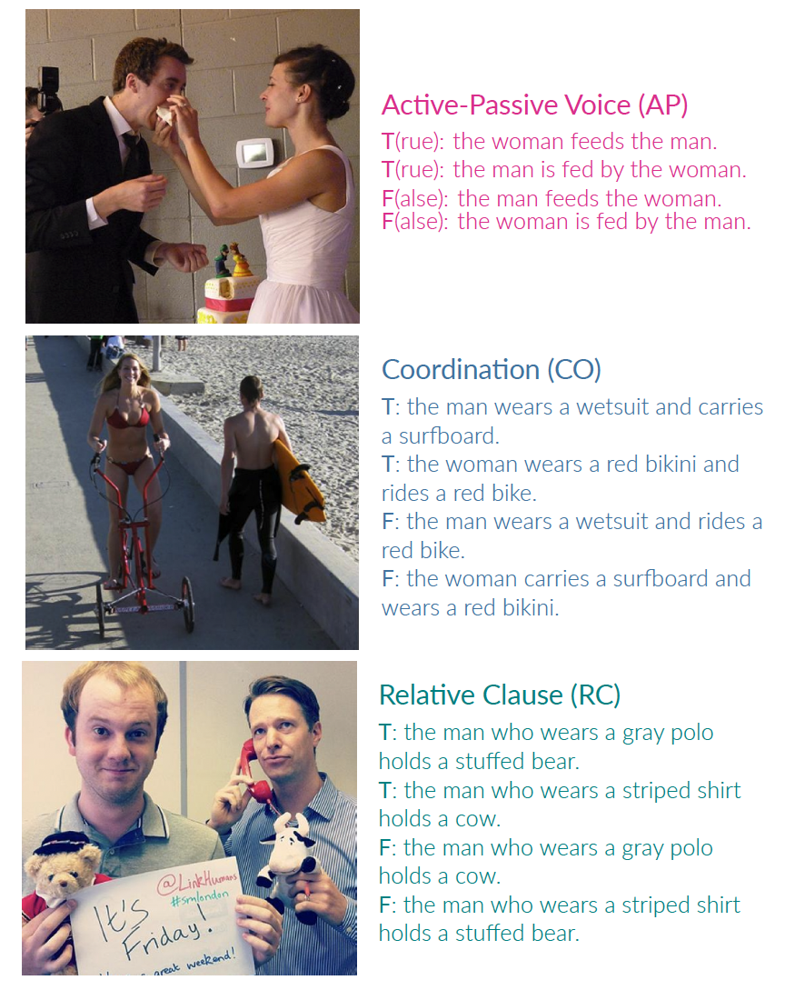

# The BLA Benchmark: Investigating Basic Language Abilities of Multimodal Models

Code and data are described in the paper:
> Xinyi Chen, Raquel Fernández and Sandro Pezzelle. [The BLA Benchmark: Investigating Basic Language Abilities of Pre-Trained Multimodal Models](https://arxiv.org/abs/2310.15061). In the Proceedings of EMNLP 2023 (Singapore, 6-10 December 2023).

We provide the benchmark dataset and code for reproducing our results.

<!-- ## News
- 07-2023: Added code for [IGLUE](https://iglue-benchmark.github.io/) ([Bugliarello et al., 2022](https://arxiv.org/pdf/2201.11732.pdf)) [[Original code](https://github.com/e-bug/iglue)]
- 02-2022: Added code for [MaRVL](https://marvl-challenge.github.io/) ([Liu and Bugliarello et al., EMNLP 2021](https://arxiv.org/pdf/2109.13238.pdf)) [[Original code](https://github.com/marvl-challenge/marvl-code)]
- 09-2021: Added code for `cross-modal ablation` ([Frank and Bugliarello et al., EMNLP 2021](https://arxiv.org/pdf/2109.04448.pdf)) [[Original code](https://github.com/e-bug/cross-modal-ablation)] -->


<!-- ## Repository Structure
```
BLA
├── dataset
│   ├── BLA_benchmark.zip: images and text annoations for BLA benchmark
│   └── demos for each BLA task
└──  evaluation_models
    └──  scripts for zero-shot evaluation and in-context learning 
``` -->


## BLA Benchmark

BLA is a novel, automatically constructed benchmark to evaluate multimodal models on Basic Language Abilities. In the BLA tasks, we explore to what extent the models handle basic linguistic constructions—active-passive voice, coordination, and relative clauses—that even preschool children can typically master. Check out [`bla_benchmark`](bla_benchmark) for the benchmark dataset and demo examples.

## Models

<!-- Check out [`MODELS.md`](MODELS.md) for links to pretrained models and how to define new ones in VOLTA.

Model configuration files are stored in [config/](config).  -->

We investigate the following pretrained multimodel models in the experiments, and provide the links for downloading their checkpoints: [ViLBERT](https://sid.erda.dk/cgi-sid/ls.py?share_id=GWj9Oh5dx4&current_dir=conceptual_captions/volta/ctrl_vilbert&flags=f) (CTRL), [LXMERT](https://sid.erda.dk/cgi-sid/ls.py?share_id=GWj9Oh5dx4&current_dir=conceptual_captions/volta/ctrl_lxmert&flags=f) (CTRL), [CLIP](https://huggingface.co/sentence-transformers/clip-ViT-B-32) (ViT-B-32), [BLIP2](https://huggingface.co/Salesforce/blip2-flan-t5-xxl) (FlanT5 XXL), [OpenFlamingo](https://huggingface.co/openflamingo/OpenFlamingo-4B-vitl-rpj3b-langinstruct) (RedPajama-INCITE-Instruct-3B-v1), [MAGEMA](https://bit.ly/aleph_alpha_magma_download), [FROMAGe](https://drive.google.com/file/d/1wMojZNqEwApNlsCZVvSgQVtZLgbeLoKi/view?usp=share_link).


Note: Our preliminary finding suggests that MAGEMA and FROMAGe might only generate expected outputs ("yes" or "no") for 80% cases. 

## Training and Evaluation

<!-- We provide sample scripts to train (i.e. pretrain or fine-tune) and evaluate models in [examples/](examples).
These include ViLBERT, LXMERT and VL-BERT as detailed in the original papers, 
as well as ViLBERT, LXMERT, VL-BERT, VisualBERT and UNITER as specified in our controlled study.

Task configuration files are stored in [config_tasks/](config_tasks). -->

We provide scripts to perform zero-shot evaluation and task-specific learning (i.e. fine-tune or in-context learning). See repo [volta-bla](https://github.com/shin-ee-chen/volta-bla) for how to evaluate and fine-tune ViLBERT and LXMERT. 

### I) Install the required dependencies
In order to run each model on the BLA benchmark, please follow the steps described in the orginial model page to set up the environment. We suggest creating one [Conda](https://docs.conda.io/en/latest/) environment for each model.

- [CLIP](https://github.com/openai/CLIP)
- [LAVIS/projects/blip2](https://github.com/salesforce/LAVIS/tree/7f00a0891b2890843f61c002a8e9532a40343648/projects/blip2)
- [open_flamingo](https://github.com/mlfoundations/open_flamingo)
- [magma](https://github.com/Aleph-Alpha/magma)
- [fromage](https://github.com/kohjingyu/fromage)


### II) Run Evaluation/Learning Scripts

#### CLIP
Run CLIP on BLA Active-Passive task in a zero-shot setting

```
cd evaluation_models/clip

python test_clip_bla.py --annotation_dir dataset/BLA_Benchmark/annotations --img_dir dataset/BLA_Benchmark/images --phenomenon ap
 ```
#### BLIP2
Run BLIP2 on BLA Active-Passive task in a zero-shot setting
```
cd evaluation_models/blip2

python test_blip2_bla.py --annotation_dir dataset/BLA_Benchmark/annotations --img_dir dataset/BLA_Benchmark/images --phenomenon ap -dataset_type whole
 ```
 
Run BLIP2 on BLA Active-Passive task using in-context learning
```
cd evaluation_models/blip2

python test_blip2_bla.py --annotation_dir dataset/BLA_Benchmark/annotations --img_dir dataset/BLA_Benchmark/images --phenomenon ap -dataset_type test --in_context_learning
 ```

Run BLIP2 on BLA Coordination task using in-context learning with cross dataset examples from Relative Clause
```
cd evaluation_models/blip2

python test_blip2_bla.py --annotation_dir dataset/BLA_Benchmark/annotations --img_dir dataset/BLA_Benchmark/images --phenomenon co -dataset_type test --in_context_learning --cross_dataset_example --example_task rc
 ```

#### OpenFlamingo
Run OpenFlamingo on BLA Active-Passive task in a zero-shot setting
```
cd evaluation_models/openflamingo

python test_oflamingo_bla.py --annotation_dir dataset/BLA_Benchmark/annotations --img_dir dataset/BLA_Benchmark/images --phenomenon ap -dataset_type whole
 ```

### Other models
Check out [test_fromage_bla.py](evaluation_models/fromage/test_fromage_bla.py) and [test_magma_bla.py](evaluation_models/magma/test_magma_bla.py) for example codes to run fromage and magma.


## License

This work is licensed under the MIT license. See [`LICENSE`](LICENSE) for details. 
Third-party software and data sets are subject to their respective licenses. <br>
If you find our code/data/models or ideas useful in your research, please consider citing the paper:
```
@inproceedings{chen2023bla,
  title={The BLA Benchmark: Investigating Basic Language Abilities of Pre-Trained Multimodal Models},
  author={Chen, Xinyi and Fern{\'a}ndez, Raquel and Pezzelle, Sandro},
  booktitle={Proceedings of the 2023 Conference on Empirical Methods in Natural Language Processing},
  pages={5817--5830},
  year={2023}
}
```

## Contact
For questions, comments, or concerns, reach out to: **x dot chen2 at uva dot nl**