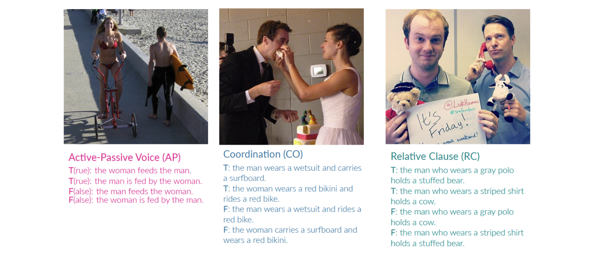

# The BLA Benchmark

## About
The BLA benchmark contains three tasks with each focusing on one specific linguistic constructions. The tasks are Active-Passive Voice, Coordination, and Relative Clauses. Each datapoint consists of one natural image and four generated sentences: Two are correct descriptions labeled as True and two are incorrect ones, labeled as False. The False sentences are identical to True ones with respect to their format and syntactic structure but contain a mistake that makes them semantically incorrect for the image. More details about the BLA benchmark can be found in our [paper](https://aclanthology.org/2023.emnlp-main.356/).

## Download
The dataset can be downloaded via this [link](https://www.dropbox.com/scl/fi/kocjr2gk3hf667r53p10a/BLA_benchmark.zip?rlkey=dxi37fvx3bxhgrgr5ps9pp851&dl=0). 